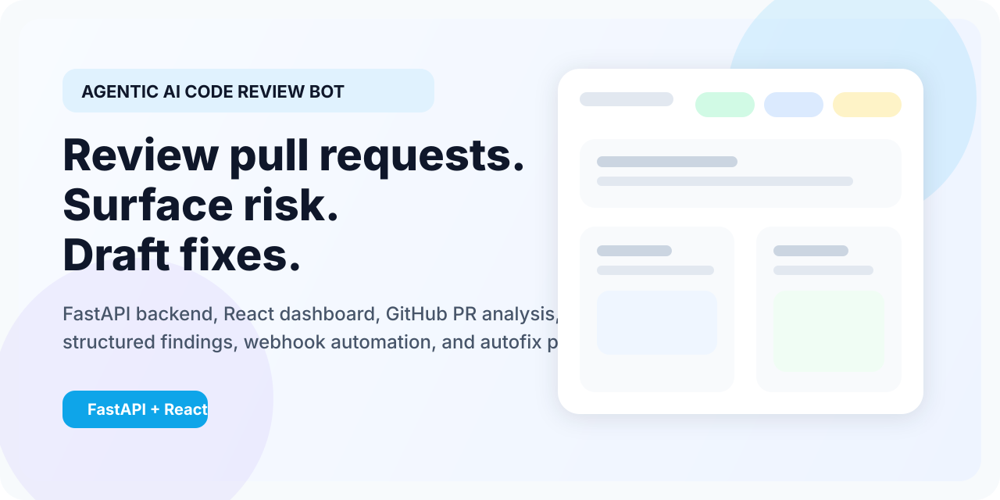
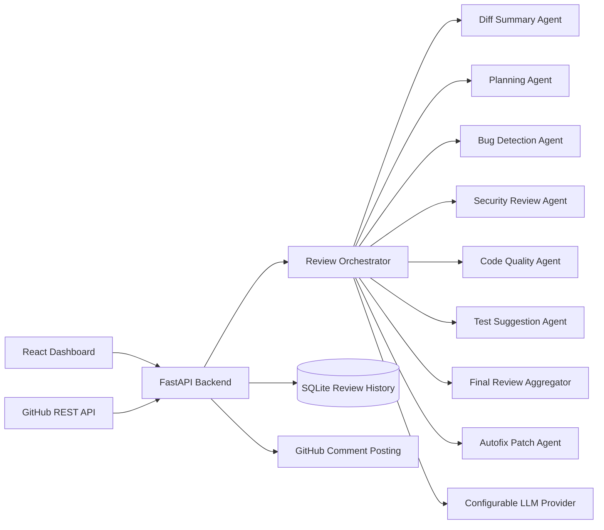

[](https://github.com/Jatin29AFK/Agentic-AI-Code-Review-Bot/actions/workflows/ci.yml)
[](LICENSE)
[](backend/requirements.txt)
[](https://fastapi.tiangolo.com/)
[](frontend/package.json)
[](frontend/package.json)

# Agentic AI Code Review Bot

AI-powered GitHub pull request review system that fetches live PR diffs, runs a multi-agent review workflow, stores structured findings, and generates human-reviewable autofix patch drafts.



## Overview

Software teams spend a lot of time manually reviewing pull requests for regressions, security concerns, code quality issues, and missing tests. This project automates that first pass while staying grounded in the actual GitHub diff.

## Features

- Manual PR review from repo URL + pull request number
- GitHub webhook mode for `pull_request` events
- Multi-agent review workflow:
  - diff summary
  - planning
  - bug detection
  - security review
  - code quality review
  - test suggestions
  - final aggregation
  - autofix patch drafting
- Structured findings with severity, category, confidence, and suggested fix
- Review score and risk calculation
- Comment preview and GitHub PR comment posting
- SQLite review history
- React dashboard for history, results, filters, and autofix drafts
- Dockerized local development

## Product Preview


## Tech Stack

### Frontend

- React + Vite
- Tailwind CSS
- React Router
- Lucide icons

### Backend

- FastAPI
- SQLAlchemy
- SQLite
- Pydantic
- `httpx`
- Custom agent orchestrator

### AI / Integrations

- Configurable LLM provider via environment variables
- GitHub REST API integration

### Tooling

- Docker + Docker Compose
- GitHub Actions CI
- Render backend deployment config
- Vercel frontend deployment config

## Architecture



## Agent Workflow

1. `Diff Summary Agent` summarizes what changed and identifies impacted modules.
2. `Planning Agent` decides which specialist checks are relevant for the diff.
3. Specialist agents inspect the change for:
   - bugs
   - security issues
   - quality and maintainability problems
   - missing tests
4. `Final Review Aggregator` merges findings, removes duplicate commentary, and produces the final summary.
5. `Autofix Agent` drafts unified diff patches for eligible high-confidence findings.

## Autofix Patch Drafts

Autofix is intentionally human-in-the-loop.

- only runs after final issue aggregation
- only targets supported textual files present in the reviewed diff
- prioritizes high-confidence `bug`, `quality`, and selected `security` findings
- returns structured metadata plus a `unified_diff` patch
- never auto-applies changes
- fails honestly if the model response is invalid or untrustworthy

Example draft shape:

```json
{
  "issue_id": "issue_8910ad4b150c",
  "file": "src/requests/models.py",
  "line": 391,
  "fix_title": "Fix PreparedRequest.copy() sharing hooks reference with original",
  "rationale": "The copy method shares the hooks reference with the original, which can lead to unintended side effects when modifying the copy.",
  "patch_format": "unified_diff",
  "patch_text": "--- src/requests/models.py\n+++ src/requests/models.py\n@@ -391,7 +391,7 @@\n -        p.hooks = self.hooks\n +        p.hooks = {event: list(callbacks) for event, callbacks in self.hooks.items()}",
  "confidence": 0.99,
  "safety_level": "safe",
  "status": "generated"
}
```

## Project Structure

```text
backend/
  app/
    agents/
    routes/
    services/
    config.py
    database.py
    main.py
    models.py
    schemas.py
  tests/
  requirements.txt
  Dockerfile
  .env.example

frontend/
  public/
  src/
    api/
    components/
    pages/
    styles/
    App.jsx
    main.jsx
  package.json
  Dockerfile
  .env.example
  vercel.json

.github/workflows/ci.yml
docker-compose.yml
render.yaml
README.md
```

## API Endpoints

- `GET /health`
- `POST /api/reviews/manual`
- `GET /api/reviews`
- `GET /api/reviews/{review_id}`
- `GET /api/reviews/{review_id}/details`
- `GET /api/reviews/{review_id}/comment-preview`
- `GET /api/reviews/{review_id}/autofix`
- `POST /api/reviews/{review_id}/autofix/regenerate`
- `POST /api/reviews/{review_id}/post-comments`
- `POST /api/webhooks/github`

## Environment Variables

Copy `backend/.env.example` to `backend/.env`.

```env
GITHUB_TOKEN=
GITHUB_WEBHOOK_SECRET=
LLM_PROVIDER=openai
LLM_API_KEY=
LLM_MODEL=gpt-4o-mini
DATABASE_URL=sqlite:///./reviews.db
BACKEND_CORS_ORIGINS=http://localhost:5173,http://127.0.0.1:5173,http://localhost:5175,http://127.0.0.1:5175
AUTOFIX_ENABLED=true
AUTOFIX_MAX_ISSUES_PER_REVIEW=3
AUTOFIX_MIN_CONFIDENCE=0.85
AUTOFIX_MAX_PATCH_CHARS=8000
```

Supported provider modes in code:

- `openai`
- `groq`
- `openrouter`
- `openai_compatible`

## Run Locally

### Backend

```bash
cd backend
python -m venv .venv
source .venv/bin/activate
pip install -r requirements.txt
cp .env.example .env
uvicorn app.main:app --reload --port 8000
```

### Frontend

```bash
cd frontend
npm install
npm run dev
```

### Tests

```bash
cd backend
.venv/bin/python -m unittest discover -s tests -v
```

### Docker

```bash
cp backend/.env.example backend/.env
docker compose up --build
```

## Deployment

### Backend on Render

This repo includes a root-level [render.yaml](render.yaml) using Render Blueprints. It provisions:

- a FastAPI web service
- persistent disk storage for SQLite review history
- environment variable placeholders for secrets and CORS

Deploy flow:

1. Push the repo to GitHub.
2. In Render, create a new Blueprint from this repository.
3. Fill in secret values for:
   - `LLM_API_KEY`
   - `GITHUB_TOKEN`
   - `GITHUB_WEBHOOK_SECRET`
   - `BACKEND_CORS_ORIGINS`
4. Deploy the backend and copy the public backend URL.

### Frontend on Vercel

The frontend includes [frontend/vercel.json](frontend/vercel.json) with a rewrite for React Router SPA routes.

Deploy flow:

1. Import the `frontend` directory into Vercel.
2. Set `VITE_API_BASE_URL` to your deployed backend URL.
3. Redeploy after the variable is saved.

## GitHub Webhook Setup

1. Expose the backend publicly.
2. In GitHub, open repository settings and create a webhook.
3. Set the payload URL to:

```text
https://your-backend-domain/api/webhooks/github
```

4. Set content type to `application/json`.
5. Add the same secret value to GitHub and `GITHUB_WEBHOOK_SECRET`.
6. Subscribe to `Pull request` events.

## Security Design

- user GitHub tokens are accepted per request but never stored
- likely secrets are redacted before diff content is sent to the model
- large PRs are capped by file count and patch size
- binary, generated, lock, and unsupported files are filtered out
- webhook payloads verify `X-Hub-Signature-256`
- invalid LLM output returns clear failures instead of fabricated reviews
- autofix output is draft-only and never auto-applied

## CI

GitHub Actions runs:

- backend unit tests
- frontend production build

## License

This project is licensed under the [MIT License](LICENSE).
