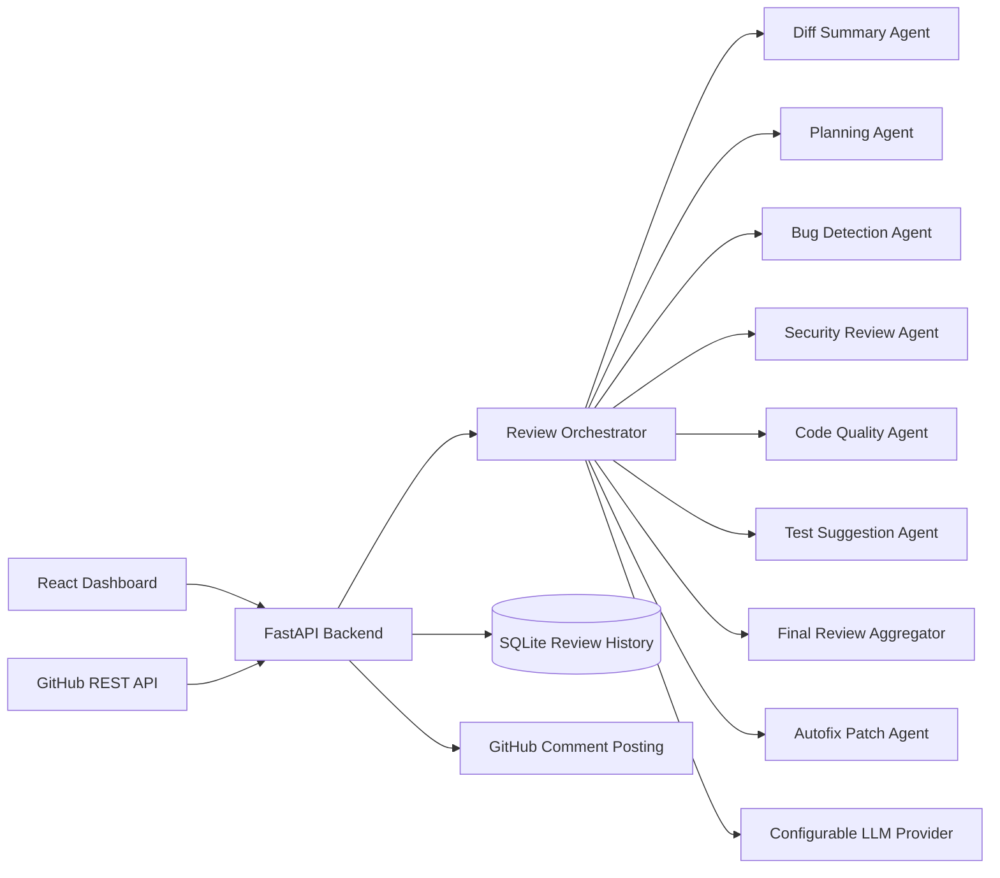

# Agentic AI Code Review Bot

AI-powered GitHub pull request reviewer that fetches live PR diffs, runs a multi-agent review workflow, generates structured engineering feedback, and proposes human-reviewable autofix patch drafts.

## Highlights

- Multi-agent PR analysis grounded only in the real GitHub diff
- Structured findings across bugs, security, quality, testing, and performance
- Human-in-the-loop autofix patch drafts for high-confidence issues
- Manual review mode, webhook-triggered review mode, and GitHub comment preview/posting
- React dashboard for review history, filtered findings, and remediation workflow
- FastAPI backend with SQLite persistence, Docker support, and configurable LLM provider

## Why this project matters

Manual PR review is expensive. Teams want quick signal on likely bugs, security risks, missing tests, and maintainability problems before a human reviewer spends time on the same ground. This project automates that first pass while staying anchored to the actual diff.

## What it does

- Fetches pull request metadata and changed files directly from the GitHub REST API
- Filters out binary, generated, lock, oversized, and unsupported files
- Redacts likely secrets before any LLM call
- Runs a multi-agent review workflow over the real diff
- Produces structured issues with severity, confidence, category, and suggested fix
- Generates recruiter-friendly autofix patch drafts for high-confidence findings
- Stores reviews and issues in SQLite for history and replay
- Supports manual review mode and GitHub webhook mode
- Posts summary and inline comments back to GitHub PRs
- Ships with a React dashboard, FastAPI backend, Dockerfiles, and Docker Compose

## Recruiter value

This project is strong portfolio material because it demonstrates:

- applied LLM engineering with structured JSON validation and fallback handling
- agent orchestration across summarization, planning, specialist analysis, aggregation, and remediation
- full-stack product delivery across backend APIs, frontend UX, persistence, and Dockerized local deployment
- GitHub platform integration, webhook verification, and secure handling of secrets and PR diffs

## Tech stack

### Frontend

- React + Vite
- Tailwind CSS
- Fetch API
- React Router
- Lucide icons

### Backend

- Python
- FastAPI
- SQLAlchemy + SQLite
- Pydantic
- Custom multi-agent orchestrator
- GitHub REST API via `httpx`

### Deployment / tooling

- Docker
- Docker Compose

## Architecture



## Agent workflow

1. `Diff Summary Agent`
   Summarizes the PR and identifies changed modules.
2. `Planning Agent`
   Decides which specialist agents should run.
3. `Bug Detection Agent`
   Looks for likely correctness problems in the changed code.
4. `Security Review Agent`
   Flags security-sensitive mistakes grounded in the diff.
5. `Code Quality Agent`
   Focuses on maintainability, complexity, and performance concerns.
6. `Test Suggestion Agent`
   Recommends valuable missing tests.
7. `Final Review Aggregator`
   Produces the final summary and trims duplicate narrative.
8. `Autofix Agent`
   Converts the top high-confidence, file-local findings into unified diff patch drafts for human review.

## Project structure

```text
backend/
  app/
    agents/
    routes/
    services/
    config.py
    database.py
    main.py
    models.py
    schemas.py
  requirements.txt
  Dockerfile
  .env.example

frontend/
  src/
    api/
    components/
    pages/
    styles/
    App.jsx
    main.jsx
  Dockerfile
  package.json

docker-compose.yml
README.md
```

## Backend API

- `GET /health`
- `POST /api/reviews/manual`
- `GET /api/reviews`
- `GET /api/reviews/{review_id}`
- `GET /api/reviews/{review_id}/autofix`
- `POST /api/reviews/{review_id}/autofix/regenerate`
- `POST /api/reviews/{review_id}/post-comments`
- `POST /api/webhooks/github`

## Frontend experience

- Dashboard with review volume, average score, total issues, and high-risk PR counts
- New Review flow with repo URL, PR number, optional token, and staged loading states
- Review Result page with grouped findings, filters, comment preview, and autofix drafts
- Review History page with stored review summaries and autofix availability

## Review output

Each issue uses this schema:

```json
{
  "file": "path/to/file.py",
  "line": 45,
  "severity": "critical",
  "category": "security",
  "title": "Hardcoded credential in request header",
  "description": "The diff introduces a token directly into source code.",
  "suggested_fix": "Load the token from environment variables and inject it at runtime.",
  "confidence": 0.96
}
```

Score rules:

- Start from `100`
- `critical`: `-20`
- `high`: `-12`
- `medium`: `-7`
- `low`: `-3`
- `suggestion`: `-1`

Risk rules:

- `high` if any critical issue exists or score is below `60`
- `medium` if score is between `60` and `80`
- `low` if score is above `80`

## Autofix patch drafts

The review bot can generate draft-only remediation patches for a small number of strong findings.

- Runs only after the final review result is aggregated
- Targets supported textual files already present in the reviewed PR diff
- Prioritizes high-confidence `bug`, `quality`, and selected local `security` findings
- Returns structured metadata plus a `unified_diff` patch
- Never auto-applies changes or pushes code back to GitHub
- Surfaces failures honestly when the LLM output is invalid or unusable

Draft schema:

```json
{
  "issue_id": "issue_3f1b0fd9b4c2",
  "file": "requests/models.py",
  "line": 412,
  "fix_title": "Clone hook collections before copying the request",
  "rationale": "The copied request currently shares hook state with the original object, which can cause side effects across callers.",
  "patch_format": "unified_diff",
  "patch_text": "--- a/requests/models.py\n+++ b/requests/models.py\n@@ ...",
  "confidence": 0.91,
  "safety_level": "needs_review",
  "status": "generated"
}
```

## Environment variables

Copy `backend/.env.example` to `backend/.env` and fill in your values.

```env
GITHUB_TOKEN=
GITHUB_WEBHOOK_SECRET=
LLM_PROVIDER=openai
LLM_API_KEY=
LLM_MODEL=gpt-4o-mini
DATABASE_URL=sqlite:///./reviews.db
BACKEND_CORS_ORIGINS=http://localhost:5173
AUTOFIX_ENABLED=true
AUTOFIX_MAX_ISSUES_PER_REVIEW=3
AUTOFIX_MIN_CONFIDENCE=0.85
AUTOFIX_MAX_PATCH_CHARS=8000
```

Supported LLM provider modes in code today:

- `openai`
- `groq`
- `openrouter`
- `openai_compatible`

Optional extra env supported by the backend:

- `LLM_BASE_URL`
- `POST_WEBHOOK_COMMENTS`
- `MAX_FILES_REVIEWED`
- `MAX_PATCH_CHARS_PER_FILE`
- `MAX_TOTAL_PATCH_CHARS`
- `AUTOFIX_ENABLED`
- `AUTOFIX_MAX_ISSUES_PER_REVIEW`
- `AUTOFIX_MIN_CONFIDENCE`
- `AUTOFIX_MAX_PATCH_CHARS`

## Local setup

### 1. Backend

```bash
cd backend
python -m venv .venv
source .venv/bin/activate
pip install -r requirements.txt
cp .env.example .env
uvicorn app.main:app --reload --port 8000
```

### 2. Frontend

```bash
cd frontend
npm install
npm run dev
```

Frontend runs on `http://localhost:5173` by default.

### 3. Run tests

```bash
cd backend
.venv/bin/python -m unittest discover -s tests -v
```

## Docker setup

```bash
cp backend/.env.example backend/.env
docker compose up --build
```

Services:

- Frontend: `http://localhost:3000`
- Backend: `http://localhost:8000`

## How to test with a GitHub PR

1. Start the backend and frontend.
2. Open the dashboard.
3. Go to `New Review`.
4. Paste a public repository URL such as `https://github.com/owner/repo`.
5. Enter a valid pull request number.
6. Add a GitHub token if the repo is private or rate limits are tight.
7. Run the review and inspect the structured result page.
8. Open the `Autofix drafts` section to inspect, copy, or export candidate patch files.

## GitHub webhook setup

1. Expose your backend URL publicly.
2. In GitHub, open repository settings, then `Webhooks`.
3. Add a webhook pointing to:

```text
POST /api/webhooks/github
```

4. Set content type to `application/json`.
5. Add the same secret to GitHub and `GITHUB_WEBHOOK_SECRET`.
6. Subscribe to `Pull request` events.
7. Enable `POST_WEBHOOK_COMMENTS=true` if you want webhook-triggered reviews to auto-comment when a backend GitHub token is configured.

## Security choices

- GitHub tokens are accepted per request but never stored in SQLite
- Likely secrets are redacted from diffs before LLM submission
- Webhook requests verify `X-Hub-Signature-256`
- Large PRs are capped by file count and patch size
- Binary and generated files are excluded
- GitHub rate limit failures return explicit API errors

## Production-minded design choices

- LLM provider is configured entirely through environment variables
- User-supplied GitHub tokens are used transiently and never stored
- Oversized or irrelevant files are filtered before review
- Secret redaction runs before diff content is sent to the model
- Autofix patches are draft-only and never auto-applied
- Invalid LLM outputs degrade to explicit failures instead of fabricated results

## Screenshots

- Add dashboard screenshot here
- Add review result screenshot here
- Add autofix drafts screenshot here
- Add review history screenshot here

## Demo example

Example end-to-end flow for a recruiter demo:

1. Review a real PR diff from GitHub.
2. The bot flags an actionable issue such as shared mutable state in a copied object.
3. The result page shows:
   - structured review finding
   - comment preview for GitHub posting
   - autofix draft with rationale and unified diff patch
4. You can copy the patch, export it as a `.patch` file, or regenerate drafts for the current review.

Illustrative patch draft snippet:

```diff
--- a/example/module.py
+++ b/example/module.py
@@ -41,7 +41,7 @@
-    copied.hooks = self.hooks
+    copied.hooks = deepcopy(self.hooks)
```

## Resume-ready highlights

- Built an agentic AI code review system that analyzes real GitHub PR diffs and returns structured engineering feedback
- Designed a multi-agent orchestration pipeline for diff summarization, planning, bug detection, security review, quality review, test recommendation, and autofix patch generation
- Implemented secure GitHub webhook handling, review history persistence in SQLite, and automated PR comment posting
- Delivered a full-stack demo product with FastAPI, React, Tailwind, Docker, configurable LLM provider support, and human-in-the-loop remediation drafts

## Suggested repository metadata

- Repository name: `agentic-ai-code-review-bot`
- Short description: `AI-powered GitHub PR review bot with multi-agent analysis, structured findings, and autofix patch drafts.`
- Topics: `ai`, `llm`, `code-review`, `github`, `fastapi`, `react`, `vite`, `tailwindcss`, `agentic-ai`, `automation`

## Notes

- The bot does not fabricate reviews; it only analyzes the fetched PR diff.
- If the LLM provider is unavailable or invalidly configured, the backend returns a clear failure instead of inventing output.
- Inline GitHub comments are posted only when both file path and line number are available.
