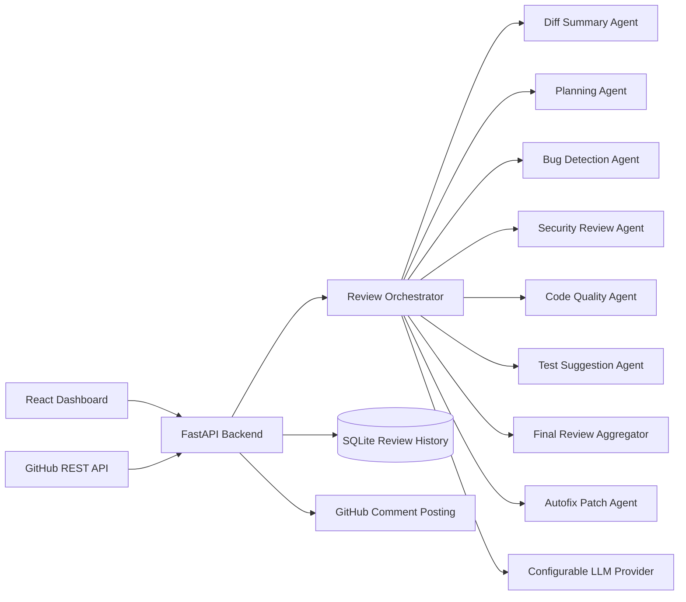

[](https://github.com/Jatin29AFK/Agentic-AI-Code-Review-Bot/actions/workflows/ci.yml)
[](LICENSE)
[](backend/requirements.txt)
[](https://fastapi.tiangolo.com/)
[](frontend/package.json)
[](frontend/package.json)

# Agentic AI Code Review Bot

AI-powered GitHub pull request review system that fetches live PR diffs, runs a multi-agent review workflow, stores structured findings, and generates human-reviewable autofix patch drafts.


## Overview

Software teams spend a lot of time manually reviewing pull requests for regressions, security concerns, code quality issues, and missing tests. This project automates that first pass while staying grounded in the actual GitHub diff.

## Features

- Manual PR review from repo URL + pull request number
- Flexible GitHub access modes:
  - public repo review without a token
  - higher-rate public repo review with a PAT
  - private repo review with a repo-scoped token
  - optional GitHub comment posting with write permissions
- GitHub webhook mode for `pull_request` events
- Multi-agent review workflow:
  - diff summary
  - planning
  - bug detection
  - security review
  - code quality review
  - test suggestions
  - final aggregation
  - autofix patch drafting
- Structured findings with severity, category, confidence, and suggested fix
- Review score and risk calculation
- Comment preview and GitHub PR comment posting
- Optional path filters for targeted reviews
- Lightweight release notes generated from each review
- Skip-noise LGTM comment mode when a review is low risk with no actionable issues
- SQLite review history
- Recent review input recall for faster reruns
- React dashboard for history, results, filters, sorting, and autofix drafts
- Dockerized local development

## Product Preview


## Tech Stack

### Frontend

- React + Vite
- Tailwind CSS
- React Router
- Lucide icons

### Backend

- FastAPI
- SQLAlchemy
- SQLite
- Pydantic
- `httpx`
- Custom agent orchestrator

### AI / Integrations

- Configurable LLM provider via environment variables
- GitHub REST API integration

### Tooling

- Docker + Docker Compose
- GitHub Actions CI
- Render backend deployment config
- Vercel frontend deployment config

## Architecture



## Agent Workflow

1. `Diff Summary Agent` summarizes what changed and identifies impacted modules.
2. `Planning Agent` decides which specialist checks are relevant for the diff.
3. Specialist agents inspect the change for:
   - bugs
   - security issues
   - quality and maintainability problems
   - missing tests
4. `Final Review Aggregator` merges findings, removes duplicate commentary, and produces the final summary.
5. `Autofix Agent` drafts unified diff patches for eligible high-confidence findings.

## Autofix Patch Drafts

Autofix is intentionally human-in-the-loop.

- only runs after final issue aggregation
- only targets supported textual files present in the reviewed diff
- prioritizes high-confidence `bug`, `quality`, and selected `security` findings
- returns structured metadata plus a `unified_diff` patch
- never auto-applies changes
- fails honestly if the model response is invalid or untrustworthy

Example draft shape:

```json
{
  "issue_id": "issue_8910ad4b150c",
  "file": "src/requests/models.py",
  "line": 391,
  "fix_title": "Fix PreparedRequest.copy() sharing hooks reference with original",
  "rationale": "The copy method shares the hooks reference with the original, which can lead to unintended side effects when modifying the copy.",
  "patch_format": "unified_diff",
  "patch_text": "--- src/requests/models.py\n+++ src/requests/models.py\n@@ -391,7 +391,7 @@\n -        p.hooks = self.hooks\n +        p.hooks = {event: list(callbacks) for event, callbacks in self.hooks.items()}",
  "confidence": 0.99,
  "safety_level": "safe",
  "status": "generated"
}
```

## Project Structure

```text
backend/
  app/
    agents/
    routes/
    services/
    config.py
    database.py
    main.py
    models.py
    schemas.py
  tests/
  requirements.txt
  Dockerfile
  .env.example

frontend/
  public/
  src/
    api/
    components/
    pages/
    styles/
    App.jsx
    main.jsx
  package.json
  Dockerfile
  .env.example
  vercel.json

.github/workflows/ci.yml
docker-compose.yml
render.yaml
README.md
```

## API Endpoints

- `GET /health`
- `POST /api/reviews/manual`
- `GET /api/reviews`
- `GET /api/reviews/{review_id}`
- `GET /api/reviews/{review_id}/details`
- `GET /api/reviews/{review_id}/comment-preview`
- `GET /api/reviews/{review_id}/autofix`
- `POST /api/reviews/{review_id}/autofix/regenerate`
- `POST /api/reviews/{review_id}/post-comments`
- `POST /api/webhooks/github`

## Environment Variables

Copy `backend/.env.example` to `backend/.env`.

```env
GITHUB_TOKEN=
GITHUB_WEBHOOK_SECRET=
LLM_PROVIDER=groq
LLM_API_KEY=
LLM_MODEL=llama-3.1-8b-instant
DATABASE_URL=sqlite:///./reviews.db
BACKEND_CORS_ORIGINS=http://localhost:5173,http://127.0.0.1:5173,http://localhost:5175,http://127.0.0.1:5175
POST_WEBHOOK_COMMENTS=false
AUTOFIX_ENABLED=true
AUTOFIX_MAX_ISSUES_PER_REVIEW=3
AUTOFIX_MIN_CONFIDENCE=0.85
AUTOFIX_MAX_PATCH_CHARS=8000
```

Copy `frontend/.env.example` to `frontend/.env` when running the UI locally.

```env
VITE_API_BASE_URL=http://127.0.0.1:8000
```

Supported provider modes in code:

- `openai`
- `groq`
- `openrouter`
- `openai_compatible`

## GitHub Access Modes

### Public repo, review only

- Paste the repo URL and PR number
- Leave the GitHub token empty
- Best for occasional reviews
- GitHub unauthenticated REST API usage is rate limited, so heavy use may require a token

### Public repo, reliable review

- Paste the repo URL and PR number
- Add a fine-grained PAT in the GitHub token field when you want higher rate limits
- Good for repeated testing or demo sessions

### Private repo

- Paste the repo URL and PR number
- Add a token that has access to that repository

### Post comments back to GitHub

Use a token with write permissions.

For a fine-grained PAT, grant:

- repository access to the target repo
- `Pull requests: Read and write`
- `Issues: Read and write`
- `Contents: Read-only`

## Using the App

### Fastest way to start

1. Open `New Review`
2. Paste a PR URL like `https://github.com/owner/repo/pull/123`
3. Click `Autofill`
4. Leave the token empty for a public-repo read-only review
5. Add path filters only if you want to scope the review
6. Start the review

### When to use a token

- no token:
  - occasional public-repo review
- token recommended:
  - repeated public-repo reviews
  - higher GitHub API limits
  - private repos
  - posting comments back to GitHub

### Path filter examples

- review only backend code:
  - `backend/**`
- review only source files and skip docs:
  - `src/**`
  - `!docs/**`
- skip markdown files:
  - `!**/*.md`

### What happens after the review runs

- summary, score, and risk level are generated
- release notes are created
- issues can be filtered by category and search text
- comment preview is generated before anything is posted to GitHub
- autofix drafts are created only for eligible high-confidence findings

## Run Locally

### Backend

```bash
cd backend
python -m venv .venv
source .venv/bin/activate
pip install -r requirements.txt
cp .env.example .env
uvicorn app.main:app --reload --port 8000
```

### Frontend

```bash
cd frontend
npm install
npm run dev
```

### Tests

```bash
cd backend
.venv/bin/python -m unittest discover -s tests -v
```

### Docker

```bash
cp backend/.env.example backend/.env
docker compose up --build
```

## Deployment

### Recommended Production Shape

- frontend on Vercel
- backend on Render
- Groq as the LLM provider
- `GITHUB_TOKEN` left empty by default unless you want a backend-wide token
- user-supplied tokens in the UI for private repos and GitHub comment posting

### Backend on Render (Free Web Service)

This is the simplest path if you want to deploy now without using Render Blueprint.

1. Push the repo to GitHub.
2. In Render, click `New` -> `Web Service`.
3. Connect the repository.
4. Set:
   - `Root Directory`: `backend`
   - `Runtime`: `Python 3`
   - `Build Command`: `pip install -r requirements.txt`
   - `Start Command`: `uvicorn app.main:app --host 0.0.0.0 --port $PORT`
5. Add environment variables:
   - `LLM_PROVIDER=groq`
   - `LLM_API_KEY=<your Groq API key>`
   - `LLM_MODEL=llama-3.1-8b-instant`
   - `GITHUB_TOKEN=`
   - `BACKEND_CORS_ORIGINS=https://<your-vercel-production-domain>`
   - `BACKEND_CORS_ORIGIN_REGEX=https://.*\.vercel\.app`
   - `DATABASE_URL=sqlite:///./reviews.db`
   - `POST_WEBHOOK_COMMENTS=false`
   - `AUTOFIX_ENABLED=true`
   - `AUTOFIX_MAX_ISSUES_PER_REVIEW=3`
   - `AUTOFIX_MIN_CONFIDENCE=0.85`
   - `AUTOFIX_MAX_PATCH_CHARS=8000`
6. Deploy the backend.
7. Confirm `GET /health` succeeds on the Render URL.

Important:

- Free Render storage is ephemeral, so SQLite review history can disappear after restarts or redeploys.
- For a shared production deployment, prefer user-supplied GitHub tokens in the UI rather than a broad backend token.
- If you want a clean public demo before redeploying, remove the local `backend/reviews.db` file before pushing and redeploy the backend.

### Optional Backend on Render (Blueprint / Persistent Disk)

This repo includes a root-level [render.yaml](render.yaml) using Render Blueprints. It provisions:

- a FastAPI web service
- persistent disk storage for SQLite review history
- environment variable placeholders for secrets and CORS
- SQLite persistence at `/var/data/reviews.db`

Use this path only if you want the persistent-disk setup and your Render plan supports Blueprints and disks.

Deploy flow:

1. Push the repo to GitHub.
2. In Render, create a new Blueprint from this repository.
3. Keep the generated service settings from `render.yaml`:
   - `rootDir: backend`
   - `buildCommand: pip install -r requirements.txt`
   - `startCommand: uvicorn app.main:app --host 0.0.0.0 --port $PORT`
   - persistent disk mounted at `/var/data`
   - `DATABASE_URL=sqlite:////var/data/reviews.db`
4. Fill in environment values for:
   - `LLM_API_KEY`
   - `LLM_PROVIDER=groq`
   - `LLM_MODEL=llama-3.1-8b-instant`
   - `GITHUB_TOKEN` or leave blank if you want user-supplied tokens only
   - `BACKEND_CORS_ORIGINS=https://<your-vercel-production-domain>`
   - `AUTOFIX_ENABLED=true`
   - `AUTOFIX_MAX_ISSUES_PER_REVIEW=3`
   - `AUTOFIX_MIN_CONFIDENCE=0.85`
   - `AUTOFIX_MAX_PATCH_CHARS=8000`
5. Keep `POST_WEBHOOK_COMMENTS=false` for the first production release.
6. Deploy the backend and confirm `GET /health` succeeds.
7. Copy the public backend URL for the Vercel setup.

Optional later:

- `GITHUB_WEBHOOK_SECRET`
- `BACKEND_CORS_ORIGIN_REGEX=https://.*\.vercel\.app`

### Frontend on Vercel

The frontend includes [frontend/vercel.json](frontend/vercel.json) with a rewrite for React Router SPA routes.

Deploy flow:

1. Import this GitHub repository into Vercel.
2. Set the project `Root Directory` to `frontend`.
3. Keep the existing Vite framework detection and [frontend/vercel.json](frontend/vercel.json) SPA rewrite.
4. Add `VITE_API_BASE_URL=https://<your-render-backend-domain>`.
5. Deploy or redeploy after the variable is saved.

Notes:

- The production frontend no longer falls back to a guessed backend host.
- `VITE_API_BASE_URL` must be set in Vercel for deployed environments.
- Local development still defaults to `http://<current-host>:8000` when the variable is not set.
- If you use Vercel preview deployments, keep `BACKEND_CORS_ORIGIN_REGEX=https://.*\.vercel\.app` in Render.

### Vercel Update Flow

Whenever you change frontend code or the frontend env vars:

1. Push the latest commit to GitHub.
2. In Vercel, open the project.
3. Verify `VITE_API_BASE_URL` still points to the correct Render backend.
4. Trigger a redeploy.

### Render Update Flow

Whenever you change backend code or backend env vars:

1. Push the latest commit to GitHub.
2. In Render, redeploy the service.
3. If you changed CORS values, verify `/health` and then test from the live Vercel URL.

## GitHub Webhook Setup

Webhook automation is intentionally out of scope for the first production deployment. Start with manual reviews from the UI, then enable webhook mode after the base deployment is stable.

1. Expose the backend publicly.
2. In GitHub, open repository settings and create a webhook.
3. Set the payload URL to:

```text
https://your-backend-domain/api/webhooks/github
```

4. Set content type to `application/json`.
5. Add the same secret value to GitHub and `GITHUB_WEBHOOK_SECRET`.
6. Subscribe to `Pull request` events.

## Troubleshooting

### `GitHub API request failed (403): Resource not accessible by personal access token`

Your token can read the PR but cannot write comments.

Fix:

- for a fine-grained PAT:
  - repository access to the target repo
  - `Pull requests: Read and write`
  - `Issues: Read and write`
- for a classic PAT:
  - `public_repo` for public repos
  - `repo` for private repos

### `Unexpected review failure: UNIQUE constraint failed: issues.id`

This was caused by deterministic issue IDs across repeated reviews of the same finding. The app now generates issue IDs that are unique per review run.

If you still see the error after pulling the latest code:

1. restart the backend
2. rerun the review

### `ERR_BLOCKED_BY_CLIENT` in the browser

This usually comes from a browser extension such as an ad blocker or privacy shield blocking the backend domain.

Fix:

- try the app in an incognito window
- disable the blocker for your Vercel and Render domains
- redeploy the latest frontend, which now avoids the extra standalone dashboard health ping

### Review history looks empty after deployment

On free Render, SQLite lives on an ephemeral filesystem. History can disappear after redeploys, restarts, or spin-down.

That is expected unless you switch to a persistent-disk or external database setup.

## Security Design

- user GitHub tokens are accepted per request but never stored
- likely secrets are redacted before diff content is sent to the model
- large PRs are capped by file count and patch size
- binary, generated, lock, and unsupported files are filtered out
- webhook payloads verify `X-Hub-Signature-256`
- invalid LLM output returns clear failures instead of fabricated reviews
- autofix output is draft-only and never auto-applied

## CI

GitHub Actions runs:

- backend unit tests
- frontend production build

## License

This project is licensed under the [MIT License](LICENSE).
