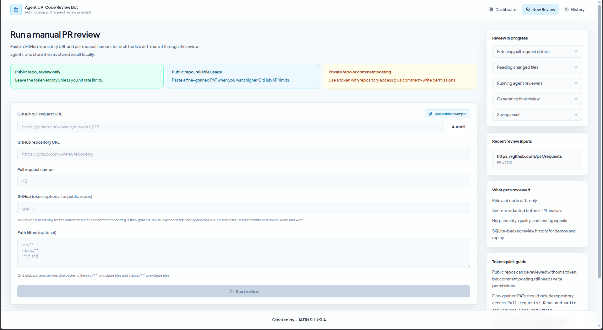
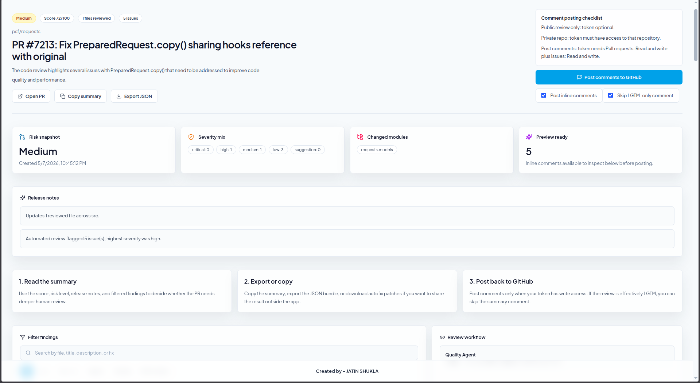
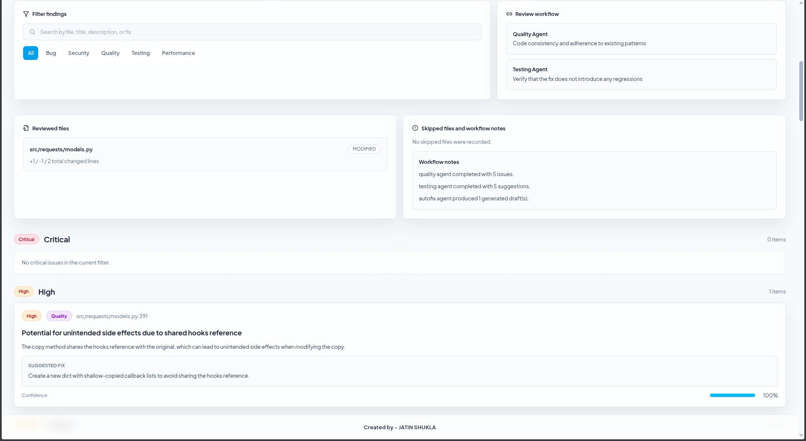
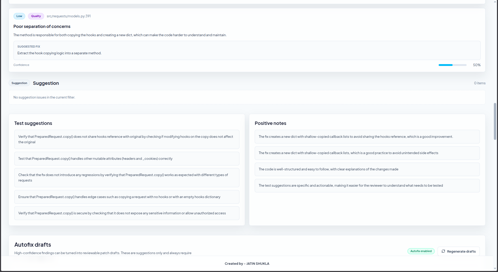
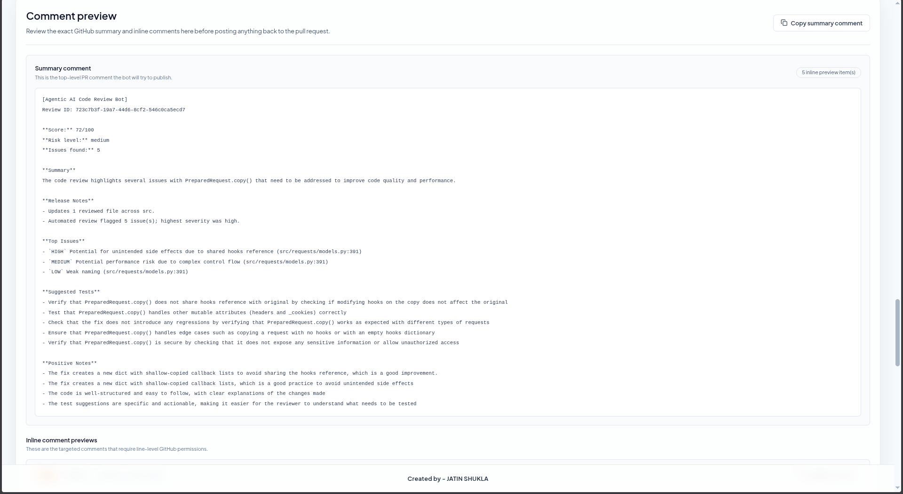
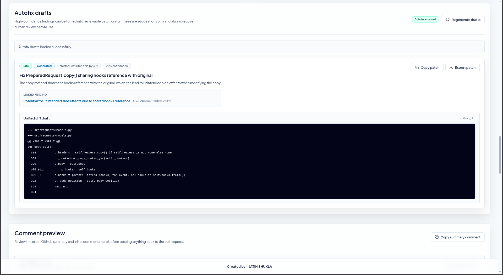
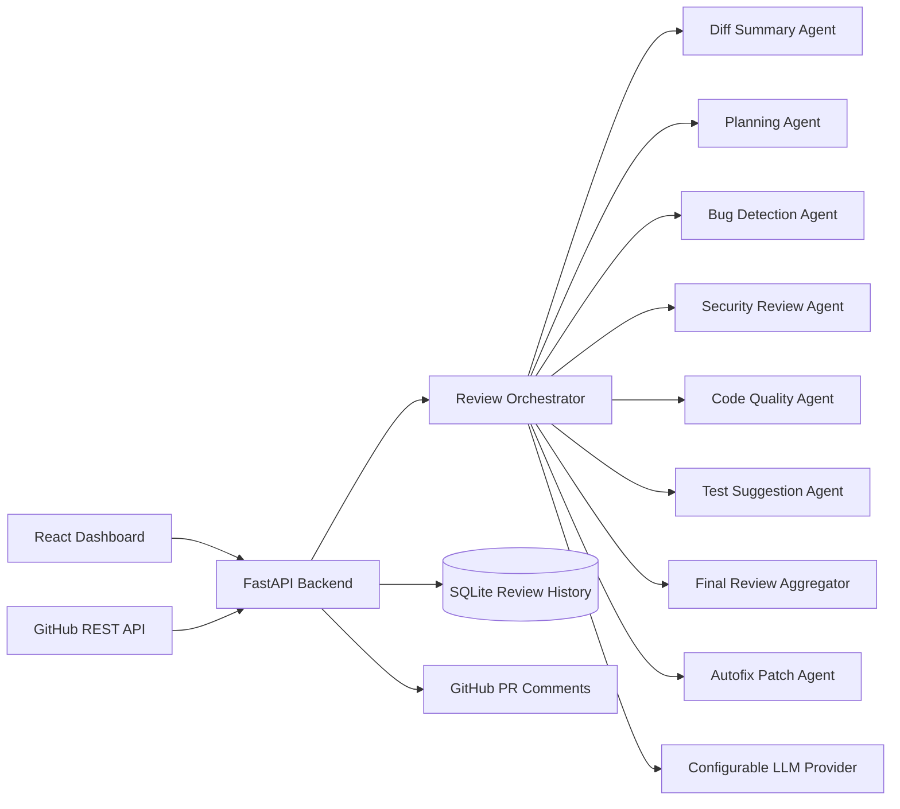

<div align="center">

# Agentic AI Code Review Bot

### Multi-agent GitHub pull request reviewer with risk scoring, structured findings, comment previews, and human-reviewable autofix patch drafts.

<br />

<!--  -->

<br />

[](https://github.com/Jatin29AFK/Agentic-AI-Code-Review-Bot/actions/workflows/ci.yml)
[](LICENSE)
[](https://github.com/Jatin29AFK/Agentic-AI-Code-Review-Bot/commits/main)
[](https://github.com/Jatin29AFK/Agentic-AI-Code-Review-Bot)

[](backend/requirements.txt)
[](https://fastapi.tiangolo.com/)
[](frontend/package.json)
[](frontend/package.json)
[](https://tailwindcss.com/)
[](https://www.sqlite.org/)
[](docker-compose.yml)
[](https://docs.github.com/en/rest)
[](#environment-variables)

</div>

---

## Live Demo: 

https://agentic-ai-code-review-bot.vercel.app

---

## Screenshots

<table>
  <tr>
    <td align="center">
      <strong>Dashboard</strong><br />
      
    </td>
    <td align="center">
      <strong>New Review</strong><br />
      
    </td>
  </tr>
  <tr>
    <td align="center">
      <strong>Review Result</strong><br />
      
    </td>
    <td align="center">
      <strong>Detailed Result</strong><br />
      
    </td>
  </tr>
  <tr>
    <td align="center">
      <strong>Bot Suggestions</strong><br />
      
    </td>
    <td align="center">
      <strong>Comment Preview</strong><br />
      
    </td>
  </tr>
  <tr>
    <td colspan="2" align="center">
      <strong>Autofix Drafts</strong><br />
      
    </td>
  </tr>
</table>

---

## Overview

**Agentic AI Code Review Bot** is an AI-powered pull request review system that performs an automated first-pass review on GitHub PRs.

It fetches live PR diffs, runs them through a multi-agent review workflow, identifies bugs, security risks, code quality issues, and missing tests, then produces structured review findings with severity, confidence, risk score, and suggested fixes.

The system is designed to support engineering teams by reducing repetitive review effort while keeping the final decision human-controlled.

---

## Why This Project Matters

Manual pull request reviews are time-consuming, especially when teams need to check for:

- regression risks
- security concerns
- missing test coverage
- poor maintainability
- risky logic changes
- repeated code review patterns

This project automates the initial review layer and gives developers a structured, explainable, and human-reviewable summary before merging code.

---

## Key Features

### Pull Request Review

- Review GitHub PRs using repository URL and pull request number
- Autofill PR details from GitHub pull request links
- Fetch live PR diffs directly from the GitHub REST API
- Support public and private repository reviews
- Review only selected files using path filters

### Multi-Agent AI Review Workflow

The review pipeline uses multiple specialized agents:

- Diff Summary Agent
- Planning Agent
- Bug Detection Agent
- Security Review Agent
- Code Quality Agent
- Test Suggestion Agent
- Final Review Aggregator
- Autofix Patch Drafting Agent

### Structured Review Findings

Each finding includes:

- issue title
- affected file and line
- severity
- category
- confidence score
- explanation
- suggested fix
- risk impact

### Risk and Score Calculation

- Overall review score
- PR risk level
- Issue severity distribution
- Confidence-based prioritization
- Low-risk review detection
- Optional skip-noise LGTM mode

### Autofix Patch Drafts

- Generates human-reviewable unified diff patch drafts
- Targets eligible high-confidence issues
- Never auto-applies patches
- Keeps developers in control
- Produces structured patch metadata

### GitHub Comment Support

- Preview comments before posting
- Post review comments back to GitHub when enabled
- Supports fine-grained GitHub tokens
- Optional webhook-based PR review automation

### Review History Dashboard

- SQLite-based review history
- Recent review input recall
- Search, filter, and sort previous reviews
- View detailed findings and generated patches
- Re-run reviews faster

---

## Tech Stack

### Frontend

| Technology | Purpose |
|---|---|
| React | UI development |
| Vite | Frontend build tool |
| Tailwind CSS | Styling |
| React Router | Client-side routing |
| Vercel Analytics | Frontend traffic and usage insights |
| Lucide React | Icons |

### Backend

| Technology | Purpose |
|---|---|
| FastAPI | REST API backend |
| SQLAlchemy | Database ORM |
| SQLite | Local review history |
| Pydantic | Request and response validation |
| httpx | GitHub API requests |
| Python 3.12 | Backend runtime |

### AI and Integrations

| Technology | Purpose |
|---|---|
| Configurable LLM Provider | AI review generation |
| Groq / OpenAI / OpenRouter / OpenAI-compatible APIs | LLM provider options |
| GitHub REST API | PR diff fetching and comment posting |
| Custom Agent Orchestrator | Multi-agent review workflow |

### DevOps

| Tool | Purpose |
|---|---|
| Docker | Containerized local setup |
| Docker Compose | Full-stack local development |
| GitHub Actions | CI workflow |
| Render | Backend deployment |
| Vercel | Frontend deployment |

---

## Architecture



---

## Agent Review Workflow

1. **Diff Summary Agent** summarizes the PR changes and identifies impacted modules.
2. **Planning Agent** decides which specialist review agents are relevant.
3. **Bug Detection Agent** checks for logical errors, edge cases, and regressions.
4. **Security Review Agent** looks for risky patterns and possible vulnerabilities.
5. **Code Quality Agent** reviews maintainability, duplication, and readability.
6. **Test Suggestion Agent** identifies missing or weak test coverage.
7. **Final Review Aggregator** merges findings and removes duplicate observations.
8. **Autofix Agent** generates patch drafts for eligible high-confidence issues.

---

## Autofix Patch Drafts

Autofix is intentionally designed as a **human-in-the-loop** feature.

It does not directly modify the repository. Instead, it generates patch drafts that developers can review, adjust, and apply manually.

### Autofix Behavior

- Runs only after final issue aggregation
- Targets supported textual files from the reviewed diff
- Prioritizes high-confidence bug, quality, and selected security findings
- Returns unified diff patches
- Avoids unsupported binary, generated, lock, or oversized files
- Fails safely if model output is invalid or unreliable

### Example Autofix Output

```json
{
  "issue_id": "issue_8910ad4b150c",
  "file": "src/requests/models.py",
  "line": 391,
  "fix_title": "Fix shared hooks reference in PreparedRequest.copy()",
  "rationale": "The copy method shares the hooks reference with the original object, which can cause unintended side effects when modifying the copied request.",
  "patch_format": "unified_diff",
  "patch_text": "--- src/requests/models.py\n+++ src/requests/models.py\n@@ -391,7 +391,7 @@\n-        p.hooks = self.hooks\n+        p.hooks = {event: list(callbacks) for event, callbacks in self.hooks.items()}",
  "confidence": 0.99,
  "safety_level": "safe",
  "status": "generated"
}
```

---

## Project Structure

```text
Agentic-AI-Code-Review-Bot/
│
├── backend/
│   ├── app/
│   │   ├── agents/
│   │   ├── routes/
│   │   ├── services/
│   │   ├── config.py
│   │   ├── database.py
│   │   ├── main.py
│   │   ├── models.py
│   │   └── schemas.py
│   │
│   ├── tests/
│   ├── requirements.txt
│   ├── Dockerfile
│   └── .env.example
│
├── frontend/
│   ├── public/
│   ├── src/
│   │   ├── api/
│   │   ├── components/
│   │   ├── pages/
│   │   ├── styles/
│   │   ├── App.jsx
│   │   └── main.jsx
│   │
│   ├── package.json
│   ├── Dockerfile
│   ├── .env.example
│   └── vercel.json
│
├── docs/
│   └── assets/
│
├── .github/
│   └── workflows/
│       └── ci.yml
│
├── docker-compose.yml
├── render.yaml
├── README.md
└── LICENSE
```

---

## API Endpoints

| Method | Endpoint | Description |
|---|---|---|
| GET | `/health` | Backend health check |
| POST | `/api/reviews/manual` | Start manual PR review |
| GET | `/api/reviews` | Fetch review history |
| GET | `/api/reviews/{review_id}` | Fetch review summary |
| GET | `/api/reviews/{review_id}/details` | Fetch detailed findings |
| GET | `/api/reviews/{review_id}/comment-preview` | Preview GitHub review comment |
| GET | `/api/reviews/{review_id}/autofix` | Fetch autofix patch drafts |
| POST | `/api/reviews/{review_id}/autofix/regenerate` | Regenerate autofix drafts |
| POST | `/api/reviews/{review_id}/post-comments` | Post review comments to GitHub |
| POST | `/api/webhooks/github` | GitHub webhook endpoint |

---

## Environment Variables

### Backend

Create a `.env` file inside the `backend` directory.

```bash
cp backend/.env.example backend/.env
```

Example configuration:

```env
GITHUB_TOKEN=
GITHUB_WEBHOOK_SECRET=

LLM_PROVIDER=groq
LLM_API_KEY=
LLM_MODEL=llama-3.1-8b-instant

DATABASE_URL=sqlite:///./reviews.db

BACKEND_CORS_ORIGINS=http://localhost:5173,http://127.0.0.1:5173,http://localhost:5175,http://127.0.0.1:5175

POST_WEBHOOK_COMMENTS=false

AUTOFIX_ENABLED=true
AUTOFIX_MAX_ISSUES_PER_REVIEW=3
AUTOFIX_MIN_CONFIDENCE=0.85
AUTOFIX_MAX_PATCH_CHARS=8000
```

Supported LLM provider modes:

- `openai`
- `groq`
- `openrouter`
- `openai_compatible`

### Frontend

Create a `.env` file inside the `frontend` directory.

```bash
cp frontend/.env.example frontend/.env
```

Example:

```env
VITE_API_BASE_URL=http://127.0.0.1:8000
```

---

## GitHub Access Modes

### Public Repository Review Without Token

Use this mode for occasional public repository reviews.

- Paste the GitHub PR URL
- Leave the token field empty
- Start the review

GitHub unauthenticated API usage is rate-limited, so repeated reviews may require a token.

### Public Repository Review With Token

Use this mode for more reliable public repository reviews.

- Add a fine-grained GitHub personal access token
- Use it for higher API limits
- Useful for demos and repeated testing

### Private Repository Review

Use this mode when reviewing private repositories.

Required:

- GitHub token with access to the target private repository
- Repository URL
- Pull request number

### Posting Comments to GitHub

To post comments back to a pull request, use a token with write permissions.

For a fine-grained GitHub token, grant:

- Repository access to the target repository
- `Pull requests: Read and write`
- `Issues: Read and write`
- `Contents: Read-only`

---

## Using the App

1. Open the **New Review** page.
2. Paste a GitHub PR URL, for example:

```text
https://github.com/owner/repo/pull/123
```

3. Click **Autofill**.
4. Leave the token empty for public read-only reviews.
5. Add a token for private repos or comment posting.
6. Add optional path filters if needed.
7. Start the review.
8. Review the generated findings, score, risk level, comment preview, and autofix drafts.

---

## Path Filter Examples

Review only backend code:

```text
backend/**
```

Review only source files and skip documentation:

```text
src/**
!docs/**
```

Skip markdown files:

```text
!**/*.md
```

---

## Run Locally

### Prerequisites

Make sure you have:

- Python 3.12+
- Node.js 18+
- npm
- Git
- Docker, optional

---

### Backend Setup

```bash
cd backend

python -m venv .venv
source .venv/bin/activate

pip install -r requirements.txt

cp .env.example .env

uvicorn app.main:app --reload --port 8000
```

Backend will run at:

```text
http://127.0.0.1:8000
```

Health check:

```text
http://127.0.0.1:8000/health
```

---

### Frontend Setup

```bash
cd frontend

npm install
npm run dev
```

Frontend will run at:

```text
http://localhost:5173
```

---

### Run Tests

```bash
cd backend
.venv/bin/python -m unittest discover -s tests -v
```

---

### Run With Docker

```bash
cp backend/.env.example backend/.env
docker compose up --build
```

---

## Deployment

### Recommended Deployment Setup

| Layer | Platform |
|---|---|
| Frontend | Vercel |
| Backend | Render |
| Database | SQLite for demo, persistent DB for production |
| LLM Provider | Groq / OpenRouter / OpenAI-compatible provider |
| Source Control | GitHub |

Vercel Web Analytics is enabled on the frontend to track deployed usage patterns and page activity.

---

## GitHub Webhook Setup

Webhook mode is optional. Start with manual review mode first, then enable webhook automation once the deployment is stable.

---

## Security Design

This project follows a safe and controlled AI review design.

- User GitHub tokens are accepted per request but not stored
- Likely secrets are redacted before sending diff content to the model
- Large PRs are capped by file count and patch size
- Binary, generated, lock, and unsupported files are filtered out
- Webhook requests verify `X-Hub-Signature-256`
- Invalid LLM output returns clear failures instead of fabricated results
- Autofix output is draft-only and never auto-applied
- GitHub comments are previewed before posting

---

<div align="center">

### Built to make pull request reviews faster, safer, and more consistent.

</div>

---
